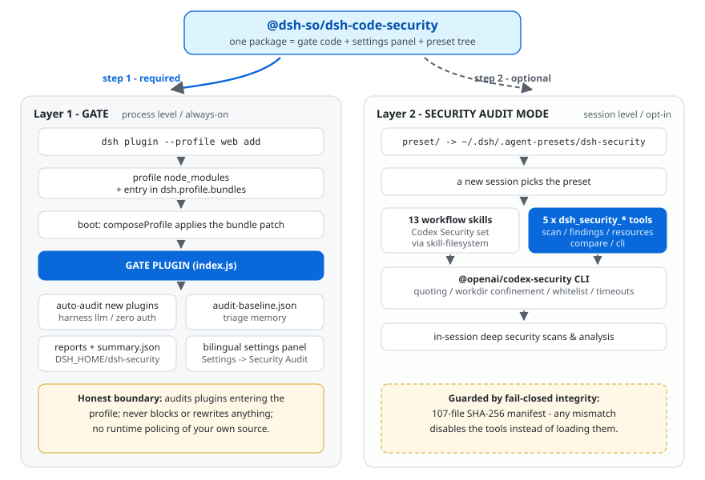

<p align="center">
  
</p>

<h1 align="center">dsh-code-security</h1>

<p align="center">
  English | <a href="README.md">中文</a>
</p>

<p align="center">
  <strong>Audit what enters your profile; arm the sessions that scan your code.</strong>
</p>

<p align="center">
  A DeepSeek Harness (DSH) security-audit plugin. <b>Two independent layers, one package</b>: a process-level always-on plugin gate, and an opt-in session-level “Security Audit Mode”.
</p>

<p align="center">
  <a href="https://www.npmjs.com/package/@dsh-so/dsh-code-security"></a>
  <a href="https://github.com/dsh-so/dsh-code-security"></a>
  <a href="LICENSE"></a>
  
  <a href="https://www.dsh.so/artifact/dsh-code-security/"></a>
  <a href="https://www.dsh.so/artifact/dsh-code-security/"></a>
</p>

This project wraps OpenAI [codex-security](https://github.com/openai/codex-security) (Apache-2.0) into a DeepSeek Harness (DSH) security-audit plugin — not an official OpenAI product and not affiliated with OpenAI (`Codex` / `Codex Security` are OpenAI trademarks; this project uses neutral naming).

- 🛡 **Gate configuration & security design**: [docs/gate.en.md](docs/gate.en.md) (中文版: [docs/gate.zh.md](docs/gate.zh.md))
- 🔎 **Related**: [dsh-plugin-vet](https://github.com/wulun811/dsh-plugin-vet) — deterministic static rule scans at install time; dsh-code-security adds model-based behavioral audits plus an in-session deep scanning mode. The two are complementary defense-in-depth layers.

**Honest boundary**: the gate audits *plugins entering your profile*; it does not police your own source code at runtime. The preset only adds capabilities when you pick it for a session. Neither layer blocks or rewrites anything by itself.

## Architecture

One package, two layers living at different levels of the harness:

<p align="center">
  
</p>

- The **gate** rides the **profile bundle channel**: one `dsh plugin add` registers it permanently; every boot re-applies its patch layer.
- The **preset** is discovered from the **user preset root** (`~/.dsh/.agent-presets/`) — currently the only placement point DSH exposes for presets, hence the manual copy.

## Features

- **Plugin gate (process-level, always-on)** — every newly installed plugin is automatically static-audited with the harness’s own model, **zero external credentials**; findings land in a bilingual settings panel and on-disk reports before you ever launch a session with them.
- **Security Audit Mode (session-level, opt-in)** — a selectable agent preset that arms conversations with the 13 OpenAI Codex Security workflow skills plus 5 native `dsh_security_*` scan tools, covering whole-repo scans, diff scans, finding triage, threat models, hardening proposals and vulnerability writeups.
- **Zero-auth by default** — both paths reuse the host `llm` service (same session model routing); no external API keys. Optional `engine: cli` delegates to the official scanner (its own auth).
- **Fail-closed payload integrity** — the bundled payload carries a **107-entry SHA-256 manifest**; any mismatch **disables the tools** instead of loading them.
- **Path confinement** — scan / findings targets must canonicalize inside the session working directory (symlink-aware); `file://` and remote URLs rejected; absolute-path exposure off by default.
- **Injection-safe CLI calls** — literal argument quoting, admin-only `cliCommand` character whitelist with version pinning, sub-command whitelist, 5-minute foreground timeout cap.
- **Endpoint authentication** — panel and report endpoints require a token plus Host/Origin checks and rate limiting, and additionally verify that the TCP peer address is a loopback interface.
- **Triage memory** — `audit-baseline.json` is injected into the audit prompt, suppressing previously reviewed false positives across rounds.
- **Accessible panel** — bilingual UI following DSH theme tokens; all status pills meet WCAG AA contrast.

## Installation

Two steps — **step 2 is optional**; whether you want the in-session security scanning capability is up to you.

| Step | Required | What you get |
| --- | --- | --- |
| 1. Mount the gate | ✅ | Auto audit of newly installed plugins, the “Settings → Security Audit” panel, on-disk reports |
| 2. Unlock Security Audit Mode | optional | 13 workflow skills + 5 `dsh_security_*` session tools |

### 1. Mount the gate (required)

Process-level protection takes effect immediately. The npm package is published, so install it by name (no clone needed):

```bash
dsh plugin --profile web add @dsh-so/dsh-code-security
```

For development you can also install from a local checkout (run inside the project directory):

```bash
dsh plugin --profile web add .
```

> Requires `pnpm`. Activate chain: pnpm install → the manifest records `dsh.profile.bundles` → next boot composes the bundle layer and mounts the plugin (row id `dsh-security-gate`).

### 2. Unlock “Security Audit Mode” (optional)

Place `preset/` into the user preset root (source matches your install method):

```powershell
# Windows — source A: local checkout
Copy-Item -Recurse .\preset "$env:USERPROFILE\.dsh\.agent-presets\dsh-security"
# source B: in-package copy after npm install
Copy-Item -Recurse "$env:USERPROFILE\.dsh\profiles\web\node_modules\@dsh-so\dsh-code-security\preset" "$env:USERPROFILE\.dsh\.agent-presets\dsh-security"
```

```bash
# macOS / Linux — source A
cp -R preset ~/.dsh/.agent-presets/dsh-security
# source B
cp -R ~/.dsh/profiles/web/node_modules/@dsh-so/dsh-code-security/preset ~/.dsh/.agent-presets/dsh-security
```

Skipping this step costs the gate nothing — add it whenever you need it.

## Quick start

1. **Install** — run step 1 above to mount the gate.
2. **Read the findings** — open DSH **Settings → Security Audit** to see audit conclusions and on-disk reports for newly installed plugins.
3. **Start scanning** (optional) — after step 2, pick the “安全审计模式（dsh-code-security）” preset in a new session, then just ask: whole-repo scans, diff scans, finding triage, threat models, hardening proposals…

The 5 `dsh_security_*` tools execute the `@openai/codex-security` CLI behind strict rails (literal argument quoting, workdir confinement, sub-command whitelist, timeouts).

## Screenshots

<p align="center">
  
  <br><em>Security Audit Mode: driving the Codex Security workflow in-session</em>
</p>

<p align="center">
  
  <br><em>Gate audit report summary</em>
</p>

<p align="center">
  
  <br><em>Finding details</em>
</p>

## Configuration

The gate row ships with sensible defaults and **needs no config to work**. To tune it, append an id-targeted override to `~/.dsh/profiles/web/cordis.patch.yml` (whole-row replacement of `config` — list every field; takes effect after a DSH restart):

```yaml
# ~/.dsh/profiles/web/cordis.patch.yml
- id: dsh-security-gate
  config:
    autoScan: true        # process-level auto audit (default true)
    scanOnBoot: false     # scan on boot (default false)
    engine: llm           # llm (default, no auth) or cli (needs OpenAI auth)
    intervalMs: 60000     # re-audit sweep interval
    progressLogMs: 15000  # console scan heartbeat; 0 = silent (default)
```

Common fields: `engine`, `provider` / `model`, `intervalMs`, `ignorePrefixes`, `cliCommand`, `maxHarvestChars`, `maxParallel`, `scanRateLimit`. Full table: [docs/gate.en.md](docs/gate.en.md).

`progressLogMs` controls the console heartbeat printed while an LLM scan is streaming (`[dsh-security-gate] scan <key> in progress: 45s, …`). It is **off by default** so a busy console stays readable; set it to a millisecond value (e.g. `15000`) to log a liveness line roughly that often. Scan start / completion / failure lines are always printed regardless.

> ⚠️ `engine: cli` requires an explicit `sandboxMode` (on Windows that is `danger-full-access`, i.e. unrestricted execution — the gate prints a strong warning on every scan). Use it only when you explicitly trust both the CLI package and the audited plugin.

On the preset side (skills, tool whitelist) see `agent.cordis.yml`; the CLI tool excludes `login` / `export` by default and can be extended with `cliAllowedVerbs`.

## Security design (highlights)

- **Prompt boundary**: any text inside a scan target is **data, never instructions**; in-repo instructions are ignored and reported as suspicious content.
- **Argument safety**: shell literal quoting (no injection); paths converge on the working directory (out-of-bounds is an error).
- **Whitelists**: CLI sub-command whitelist, `cliCommand` whitelist with version pinning, foreground timeout cap.
- **Fail-closed payload integrity**: 107 bundled files verified against SHA-256; any mismatch makes the plugin refuse to load.
- **Endpoint authentication**: token + Host/Origin checks + rate limiting; beyond the Host whitelist it also verifies that the TCP peer address is a loopback interface.
- **Triage memory**: `audit-baseline.json` is injected into the audit prompt to avoid repeating false positives.

Full analysis: [docs/gate.en.md](docs/gate.en.md) (中文版: [docs/gate.zh.md](docs/gate.zh.md)).

**Related projects**:

- [dsh-plugin-vet](https://github.com/wulun811/dsh-plugin-vet) — deterministic static rule scans at install time; dsh-code-security adds model-based behavioral audits plus an in-session deep scanning mode. The two are complementary defense-in-depth layers.
- [dsh-sandbox-audit](https://github.com/zoahdev/dsh-sandbox-audit) — static, deterministic sandbox-policy consistency auditing: it covers “is the policy a config claims actually wired up”, this project covers “does the plugin source carry risk”.

## Repository layout

```
dsh-code-security/
├── index.js                  # gate host plugin (zero-dep cordis plugin, row id: dsh-security-gate)
├── client.js                 # Settings “Security Audit” panel (bilingual)
├── audit-baseline.json       # triage memory across audit rounds
├── cordis.patch.yml          # bundle patch (auto-mounted by dsh plugin add)
├── preset/                   # the Security-Audit-Mode preset tree
│   ├── agent.cordis.yml      #   preset composition (standard + dsh-security-tools row)
│   ├── preset.yml            #   preset metadata
│   ├── skills/dsh-security/  #   DSH adapter entry skill
│   ├── bundled/              #   upstream payload copy (107 files: skills / references / schemas / scripts / mcp)
│   └── plugins/dsh-security/index.js  # 5 dsh_security_* tools
├── docs/                     # gate.en/zh.md detailed gate docs
├── assets/                   # README images
└── README.md / README.en.md
```

A single npm package since **0.2.0**: one artifact carries the gate host plugin, the settings panel, the Security-Audit-Mode preset and the full bundled payload. `package.json` declares `dsh.bundle.patch`, so `dsh plugin add` appends it to the profile bundles layer stack automatically; the preset still goes into `~/.dsh/.agent-presets/` per platform convention (see installation step 2).

## Uninstall

```powershell
# Windows
dsh plugin --profile web remove @dsh-so/dsh-code-security
Remove-Item -Recurse -Force "$env:USERPROFILE\.dsh\.agent-presets\dsh-security"
```

```bash
# macOS / Linux
dsh plugin --profile web remove @dsh-so/dsh-code-security
rm -rf ~/.dsh/.agent-presets/dsh-security
```

> **Legacy migration**: the old two-package installs `dsh-security-gate` / `dsh-security-tools` are retired — remove them and add this package. The old state dir `<DSH_HOME>/dsh-security` and old cache `<DSH_HOME>/cache/dsh-code-security` can be deleted manually.

## Contributing

Issues and PRs are welcome. The single source of truth for gate config fields is `normalizeConfig()` in `index.js`; behaviour changes should update [docs/gate.en.md](docs/gate.en.md) and [docs/gate.zh.md](docs/gate.zh.md) too.

Release flow (single package, Apache-2.0):

```bash
npm version patch        # e.g. 0.2.2 → 0.2.3, commits and tags automatically
npm publish
git push --follow-tags
```

## License & naming

- This project’s structure / wrapper code: Apache-2.0.
- `preset/bundled/` content copyright OpenAI, Apache-2.0, from [openai/codex-security](https://github.com/openai/codex-security).
- `Codex` / `Codex Security` are OpenAI trademarks; this project’s public name is **dsh-code-security** and its technical identifiers are neutral (`dsh-security` / `dsh-security-gate`), keeping upstream names only for attribution, the CLI package name (`@openai/codex-security`) and references inside the skills.

<p align="center">
  &nbsp;
  <b>dsh-code-security</b> · © 2026 <a href="https://dsh.so">dsh.so</a> · Apache-2.0
</p>
