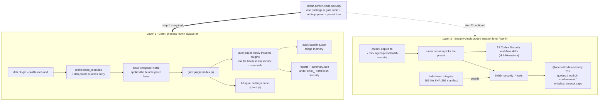

# @dsh-so/dsh-code-security — Security audit for DSH

English | [中文](README.zh.md)

[](https://www.npmjs.com/package/@dsh-so/dsh-code-security)
[](LICENSE)
[](https://github.com/wulun811/dsh-plugin-vet)

> **Audit what enters your profile; arm the sessions that scan your code.**
>
> **Two independent layers, one package:**
>
> - **Gate** (process-level, always-on): every newly installed plugin is automatically static-audited
>   with the harness's own model — zero external credentials. Findings land in a bilingual settings
>   panel and on-disk reports before you ever launch a session with them.
> - **Security Audit Mode** (session-level, opt-in): a selectable agent preset that arms conversations
>   with the 13 OpenAI Codex Security workflow skills plus 5 native `dsh_security_*` scan tools.
>
> **Honest boundary**: the gate audits *plugins entering your profile*; it does not police your own
> source code at runtime. The preset only adds capabilities when you pick it for a session. Neither
> layer blocks or rewrites anything by itself.

Wraps OpenAI [codex-security](https://github.com/openai/codex-security) (Apache-2.0) into DeepSeek
Harness (DSH). Not an official OpenAI product and not affiliated with OpenAI (`Codex` /
`Codex Security` are OpenAI trademarks; this project uses neutral naming).

- 🛡 Gate configuration table: [docs/gate.en.md](docs/gate.en.md) (中文版：[docs/gate.zh.md](docs/gate.zh.md))
- 🔎 Related: [dsh-plugin-vet](https://github.com/wulun811/dsh-plugin-vet) — deterministic static rule
  scans at install time; dsh-code-security adds model-based behavioral audits plus an in-session deep
  scanning mode. The two are complementary defense-in-depth layers.

---

## Architecture

One package, two layers living at different levels of the harness:



- The gate rides the **profile bundle channel**: one command registers it permanently; every boot
  re-applies its patch layer.
- The preset is discovered from the **user preset root** (`~/.dsh/.agent-presets/`) — currently the
  only placement point DSH exposes for presets, hence the manual copy.

---

## Installation

Two steps — **step ② is optional**: whether you want the in-session security scanning capability
is up to you.

### ① Mount the gate (required)

Process-level protection takes effect immediately: auto static audit of newly installed plugins,
the "Settings → Security Audit" panel, audit reports.

```bash
# From a local checkout (current stage; run inside the project directory)
dsh plugin --profile web add .
```

Once the npm package is published, use the package name instead (no clone needed):

```bash
dsh plugin --profile web add @dsh-so/dsh-code-security
```

> Requires `pnpm`. Activate chain: pnpm install → the manifest records `dsh.profile.bundles` →
> next boot composes the bundle layer and mounts the plugin (row id `dsh-security-gate`).

### ② Unlock "Security Audit Mode" (optional)

Adds a selectable session capability for **new sessions**: 13 Codex Security workflow skills +
5 `dsh_security_*` session tools. The gate keeps every feature without it — add whenever needed.

Place `preset/` into the user preset root (source matches your install method):

```powershell
# Windows — source A: local checkout
Copy-Item -Recurse .\preset "$env:USERPROFILE\.dsh\.agent-presets\dsh-security"
# source B: in-package copy after npm install
Copy-Item -Recurse "$env:USERPROFILE\.dsh\profiles\web\node_modules\@dsh-so\dsh-code-security\preset" "$env:USERPROFILE\.dsh\.agent-presets\dsh-security"
```

```bash
# macOS / Linux — source A
cp -R preset ~/.dsh/.agent-presets/dsh-security
# source B
cp -R ~/.dsh/profiles/web/node_modules/@dsh-so/dsh-code-security/preset ~/.dsh/.agent-presets/dsh-security
```

---

## Usage

### Mode 1 — Security Audit Mode sessions (deep audits)


Pick the preset in a new session, then ask for whole-repo scans, diff scans, finding triage,
threat models, hardening proposals… The 5 `dsh_security_*` tools execute the
`@openai/codex-security` CLI behind strict rails (literal argument quoting, workdir confinement,
sub-command whitelist, timeouts).

### Mode 2 — Gate auto-audit (process-level)


---

## Security design (highlights)

- **Zero-auth by default**: both paths use the host `llm` service (same session model routing);
  no external API keys. Optional `engine: 'cli'` delegates to the official scanner (its own auth).
- **Fail-closed payload integrity**: the bundled payload carries a 107-entry SHA-256 manifest;
  any mismatch disables the tools instead of loading them.
- **Path confinement**: scan/findings targets must canonicalize inside the session working directory
  (symlink-aware); `file://` and remote URLs rejected; absolute-path exposure off by default
  (`dsh_security_resources` returns a path-free virtual listing).
- **Injection-safe CLI calls**: literal argument quoting, admin-only `cliCommand` character
  whitelist, sub-command whitelist, 5-minute foreground timeout cap.
- **Triage memory**: an audit baseline suppresses previously reviewed false positives across rounds.
- **Accessible panel**: bilingual UI following DSH theme tokens; all status pills meet WCAG AA.

Full analysis: [docs/gate.en.md](docs/gate.en.md).

---

## Uninstall

Two reverse commands:

```powershell
# Windows
dsh plugin --profile web remove @dsh-so/dsh-code-security
Remove-Item -Recurse -Force "$env:USERPROFILE\.dsh\.agent-presets\dsh-security"
```

```bash
# macOS / Linux
dsh plugin --profile web remove @dsh-so/dsh-code-security
rm -rf ~/.dsh/.agent-presets/dsh-security
```

> Legacy leftovers (two-package / script installs): `dsh plugin --profile web remove dsh-security-gate dsh-security-tools`; old state dir `<DSH_HOME>/dsh-security` and old cache `<DSH_HOME>/cache/dsh-code-security` can be deleted manually.

---

## Project structure

```
dsh-code-security/
├── index.js                  # gate host plugin (zero-dep cordis plugin, row id: dsh-security-gate)
├── client.js                 # Settings "Security Audit" panel (bilingual)
├── audit-baseline.json       # triage memory across audit rounds
├── cordis.patch.yml          # bundle patch (auto-mounted by dsh plugin add)
├── preset/                   # the Security-Audit-Mode preset tree
│   ├── agent.cordis.yml      #   preset composition (standard + dsh-security-tools row)
│   ├── preset.yml            #   preset metadata
│   ├── skills/dsh-security/  #   DSH adapter entry skill
│   ├── bundled/              #   upstream payload copy (skills/references/schemas/scripts/mcp)
│   └── plugins/dsh-security/index.js  # 5 dsh_security_* tools
├── docs/                     # gate.en/zh.md detailed gate docs
├── assets/                   # README images
└── README.md / README.zh.md
```

---

## Development & publishing

Single npm package since 0.2.0 (Apache-2.0): one artifact carries the gate host plugin, the
settings panel, the Security-Audit-Mode preset and the full bundled payload (107 files; the
in-package integrity check keeps passing). `package.json` declares `dsh.bundle.patch`, so
`dsh plugin add` appends it to the profile bundles layer stack automatically; the preset still
goes into `~/.dsh/.agent-presets/` per platform convention (see step ② above).

Legacy packages `dsh-security-gate` / `dsh-security-tools` are retired; installs migrate by
removing them and adding this package.

---

## License & naming

- This project's structure/wrapper code: Apache-2.0.
- `preset/bundled/` content copyright OpenAI, Apache-2.0, from
  [openai/codex-security](https://github.com/openai/codex-security).

<div align="right">
  &nbsp;
  <b>dsh-code-security</b> · © 2026 <a href='https://dsh.so'>dsh.so</a> · Apache-2.0
</div>