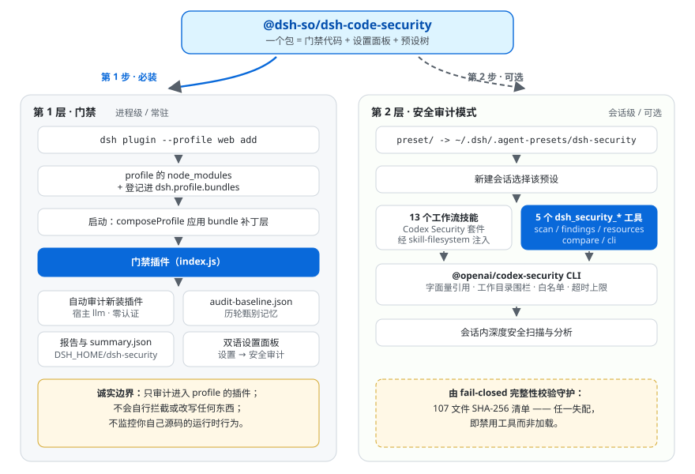

<p align="center">
  
</p>

<h1 align="center">dsh-code-security</h1>

<p align="center">
  中文 | <a href="README.md">English</a>
</p>

<p align="center">
  <strong>审计进入 profile 的插件，武装扫描代码的会话。</strong>
</p>

<p align="center">
  DeepSeek Harness（DSH）安全审计插件。<b>两层能力，彼此独立，一个包承载</b>：进程级常驻的插件门禁，与会话级按需注入的「安全审计模式」。
</p>

<p align="center">
  <a href="https://www.npmjs.com/package/@dsh-so/dsh-code-security"></a>
  <a href="https://github.com/zhousm666/dsh-code-security"></a>
  <a href="LICENSE"></a>
  
  <a href="https://www.dsh.so/artifact/dsh-code-security/"></a>
  <a href="https://www.dsh.so/artifact/dsh-code-security/"></a>
</p>

本项目把 OpenAI [codex-security](https://github.com/openai/codex-security)（Apache-2.0）封装成 DeepSeek Harness（DSH）安全审计插件 —— 非 OpenAI 官方产品，与其无任何关联（`Codex` / `Codex Security` 为 OpenAI 商标，本项目已改用中性命名）。

- 🛡 **门禁配置与安全设计**：[docs/gate.zh.md](docs/gate.zh.md)（英文版：[docs/gate.en.md](docs/gate.en.md)）
- 🔎 **相关项目**：[dsh-plugin-vet](https://github.com/wulun811/dsh-plugin-vet) —— 安装期的确定性静态规则扫描；本项目补上基于模型的行为审计与会话内深扫模式，两者是互补的纵深防御层。

**诚实边界**：门禁审计的是*进入 profile 的插件*，不监控你自己源码的运行时行为；预设只在你为会话选择它时才注入能力。两层都不会自行拦截或改写任何东西。

## 架构

一个包，两层能力，分别活在 DSH 的不同层级：

<p align="center">
  
</p>

- **门禁**走 **profile 组合包通道**：一条 `dsh plugin add` 永久登记，每次启动都会重新应用它的补丁层。
- **预设**从**用户预设根**（`~/.dsh/.agent-presets/`）发现 —— 这是 DSH 目前唯一的预设放置点，所以复制动作暂时省不掉。

## 功能特性

- **插件门禁（进程级，常驻）** — 每个新装插件都会被自动静态审计，使用宿主自身模型，**零外部凭证**；结论先进入双语设置面板与落盘报告，之后你才会带着它们启动会话。
- **安全审计模式（会话级，可选）** — 一个可选择的 agent 预设，为对话装配 13 个 OpenAI Codex Security 工作流技能 + 5 个原生 `dsh_security_*` 扫描工具，覆盖整仓扫描、diff 扫描、发现甄别、威胁建模、加固建议与漏洞写作。
- **零认证默认** — 两条路径都复用宿主 `llm` 服务（同会话模型路由），无需任何外部 API key；可选 `engine: cli` 委托官方扫描器（需其自身认证）。
- **载荷完整性 fail-closed** — bundled 载荷带 **107 条 SHA-256 清单**，任一失配即**禁用工具**而非加载。
- **路径围栏** — scan / findings 目标必须经符号链接规范化后落在会话工作目录内；拒绝 `file://` 与远程 URL；绝对路径默认不暴露。
- **注入安全的 CLI 调用** — 字面量参数引用、管理员级 `cliCommand` 字符白名单 + 版本钉扎、子命令白名单、5 分钟前台超时上限。
- **端点鉴权** — 面板与报告端点需 token + Host/Origin 校验 + 限流，并额外校验 TCP 对端地址必须是回环接口。
- **甄别记忆** — `audit-baseline.json` 注入审计提示词，跨轮次抑制已复核的误报。
- **无障碍面板** — 双语 UI 跟随 DSH 主题令牌；全部状态胶囊达 WCAG AA 对比度。

## 安装

分两步，**第 2 步可选** —— 是否需要会话内的安全扫描能力，由你决定。

| 步骤 | 必需 | 得到什么 |
| --- | --- | --- |
| 1. 挂载门禁 | ✅ | 新装插件自动审计、「设置 → 安全审计」面板、落盘报告 |
| 2. 解锁安全审计模式 | 可选 | 13 个工作流技能 + 5 个 `dsh_security_*` 会话工具 |

### 1. 挂载门禁（必装）

进程级防护立即生效。npm 包已发布，直接按包名安装（无需克隆仓库）：

```bash
dsh plugin --profile web add @dsh-so/dsh-code-security
```

开发时也可从本地 checkout 安装（在项目目录内执行）：

```bash
dsh plugin --profile web add .
```

> 需要已安装 `pnpm`。生效链路：pnpm 安装 → 清单登记 `dsh.profile.bundles` → 下次启动组合 bundles 层挂载插件（行 id `dsh-security-gate`）。

### 2. 解锁「安全审计模式」（可选）

把 `preset/` 放入用户预设根（复制源按你的安装方式二选一）：

```powershell
# Windows —— 源 A：本地 checkout
Copy-Item -Recurse .\preset "$env:USERPROFILE\.dsh\.agent-presets\dsh-security"
# 源 B：npm 安装后的包内副本
Copy-Item -Recurse "$env:USERPROFILE\.dsh\profiles\web\node_modules\@dsh-so\dsh-code-security\preset" "$env:USERPROFILE\.dsh\.agent-presets\dsh-security"
```

```bash
# macOS / Linux —— 源 A
cp -R preset ~/.dsh/.agent-presets/dsh-security
# 源 B
cp -R ~/.dsh/profiles/web/node_modules/@dsh-so/dsh-code-security/preset ~/.dsh/.agent-presets/dsh-security
```

不做这一步，门禁的任何功能都不受影响；想用时随时补上。

## 快速上手

1. **安装** —— 执行上一节第 1 步，挂载门禁。
2. **看结论** —— 打开 DSH **设置 → 安全审计**，查看新装插件的审计结论与落盘报告。
3. **开扫描**（可选）—— 完成上一节第 2 步后，新建会话时选择「安全审计模式（dsh-code-security）」预设，然后直接提出诉求：整仓扫描、diff 扫描、甄别发现、威胁建模、加固建议……

5 个 `dsh_security_*` 工具在严格护栏下执行 `@openai/codex-security` CLI（字面量参数引用、工作目录约束、子命令白名单、超时上限）。

## 界面

<p align="center">
  
  <br><em>安全审计模式：会话内驱动 Codex Security 工作流</em>
</p>

<p align="center">
  
  <br><em>门禁审计报告摘要</em>
</p>

<p align="center">
  
  <br><em>风险审计详情</em>
</p>

## 配置

门禁行自带合理默认值，**无需任何配置即可工作**。需要调整时，向 `~/.dsh/profiles/web/cordis.patch.yml` 追加一条 id 定向覆盖补丁（**整体替换** config，需列全字段；重启 DSH 后生效）：

```yaml
# ~/.dsh/profiles/web/cordis.patch.yml
- id: dsh-security-gate
  config:
    autoScan: true        # 进程级自动审计（默认 true）
    scanOnBoot: false     # 启动即扫（默认 false）
    engine: llm           # llm（默认，免认证）或 cli（需 OpenAI 认证）
    intervalMs: 60000     # 复审轮询间隔
    progressLogMs: 15000  # 扫描控制台心跳；0 = 静默（默认）
```

常用字段：`engine`、`provider` / `model`、`intervalMs`、`ignorePrefixes`、`cliCommand`、`maxHarvestChars`、`maxParallel`、`scanRateLimit`。完整配置表见 [docs/gate.zh.md](docs/gate.zh.md)。

`progressLogMs` 控制 LLM 扫描流式进行时的控制台心跳（形如 `[dsh-security-gate] scan <key> in progress: 45s, …`）。**默认关闭**，保持控制台清爽；设为毫秒值（如 `15000`）则大约按该间隔输出一条存活日志。扫描的开始 / 完成 / 失败日志始终照常打印。

> ⚠️ `engine: cli` 必须显式配置 `sandboxMode`（Windows 上为 `danger-full-access`，等于非受限执行 —— 门禁每次扫描都会打强警告）。仅在明确信任 CLI 包与被扫插件时使用。

预设侧（技能、工具白名单）见 `agent.cordis.yml`；CLI 工具默认排除 `login` / `export`，可用 `cliAllowedVerbs` 扩展。

## 安全设计（要点）

- **提示词边界**：扫描目标中的任何文本都是**数据**而非指令；仓库内嵌指令一律忽略并作为可疑内容上报。
- **参数安全**：shell 字面量转义（无注入）；路径收敛到工作目录（越界报错）。
- **白名单**：CLI 子命令白名单、`cliCommand` 白名单 + 版本钉扎、前台超时上限。
- **载荷完整性 fail-closed**：bundled 107 文件 SHA-256 校验，任一不符插件拒绝加载。
- **端点鉴权**：token + Host/Origin 校验 + 限流；Host 白名单之外还校验 TCP 对端地址必须是回环接口。
- **甄别记忆**：`audit-baseline.json` 注入审计提示词，避免重复误报。

完整分析见 [docs/gate.zh.md](docs/gate.zh.md)（英文版：[docs/gate.en.md](docs/gate.en.md)）。

**相关项目**：

- [dsh-plugin-vet](https://github.com/wulun811/dsh-plugin-vet) —— 安装期的确定性静态规则扫描；本项目补上基于模型的行为审计与会话内深扫模式，两者是互补的纵深防御层。
- [dsh-sandbox-audit](https://github.com/zoahdev/dsh-sandbox-audit) —— 静态、确定性的沙箱策略一致性审计：它管「配置声称的策略是否真的接线」，本项目管理「插件源码是否有风险」。

## 仓库结构

```
dsh-code-security/
├── index.js                  # 安全门禁宿主插件（零依赖 cordis 插件，行 id: dsh-security-gate）
├── client.js                 # 设置页「安全审计」面板（双语）
├── audit-baseline.json       # 历轮审计甄别记忆
├── cordis.patch.yml          # bundle 补丁（dsh plugin add 自动挂载）
├── preset/                   # 「安全审计模式」预设树
│   ├── agent.cordis.yml      #   预设组合（standard + dsh-security-tools 行）
│   ├── preset.yml            #   预设元数据
│   ├── skills/dsh-security/  #   DSH 适配入口技能
│   ├── bundled/              #   上游载荷拷贝（107 文件：技能 / references / schemas / scripts / mcp）
│   └── plugins/dsh-security/index.js  # 5 个 dsh_security_* 工具
├── docs/                     # gate.zh/en.md 门禁详细文档
├── assets/                   # README 配图
└── README.md / README.zh.md
```

自 **0.2.0** 起为单一 npm 包：一个工件同时携带门禁宿主插件、设置面板、「安全审计模式」预设与完整 bundled 载荷。`package.json` 声明 `dsh.bundle.patch`，`dsh plugin add` 会自动把它追加进 profile bundles 层栈；预设仍按平台规范放入 `~/.dsh/.agent-presets/`（见安装第 2 步）。

## 卸载

```powershell
# Windows
dsh plugin --profile web remove @dsh-so/dsh-code-security
Remove-Item -Recurse -Force "$env:USERPROFILE\.dsh\.agent-presets\dsh-security"
```

```bash
# macOS / Linux
dsh plugin --profile web remove @dsh-so/dsh-code-security
rm -rf ~/.dsh/.agent-presets/dsh-security
```

> **旧包迁移**：旧版双包 `dsh-security-gate` / `dsh-security-tools` 已退役，卸载它们后加装本包即完成迁移。旧状态目录 `<DSH_HOME>/dsh-security` 与旧缓存 `<DSH_HOME>/cache/dsh-code-security` 可手动删除。

## 参与贡献

欢迎提交 Issue 与 PR。门禁配置字段的唯一事实来源是 `index.js` 的 `normalizeConfig()`，改行为请连带更新 [docs/gate.zh.md](docs/gate.zh.md) 与 [docs/gate.en.md](docs/gate.en.md)。

发布流程（单包，Apache-2.0）：

```bash
npm version patch        # 例如 0.2.2 → 0.2.3，自动提交 + 打标签
npm publish
git push --follow-tags
```

## 许可证与命名

- 本项目结构 / 封装代码：Apache-2.0。
- `preset/bundled/` 内容版权归 OpenAI，许可证 Apache-2.0，来源 [openai/codex-security](https://github.com/openai/codex-security)。
- `Codex` / `Codex Security` 为 OpenAI 商标；本项目对外展示名为 **dsh-code-security**，技术标识使用 `dsh-security` / `dsh-security-gate` 等中性名称，仅在上游归属、CLI 包名（`@openai/codex-security`）与技能内引用中保留上游原名。

<p align="center">
  &nbsp;
  <b>dsh-code-security</b> · © 2026 <a href="https://dsh.so">dsh.so</a> · Apache-2.0
</p>
